# E3NG Toolchanger Official Documentation & BOM Guide

> *Disclaimer: This document was created with the assistance of AI translation. Please note that there may be awkward phrasing or grammatical errors, and we ask for your understanding.*

## General Build Guidelines
- **Bolt Substitution:** All 14mm bolts listed in the guide can be replaced with 15mm bolts.
- **Magnet Insertion:** When inserting magnets, using CA glue (superglue) is recommended to ensure they are firmly and permanently secured.

---

## Detailed Component Guide & BOM
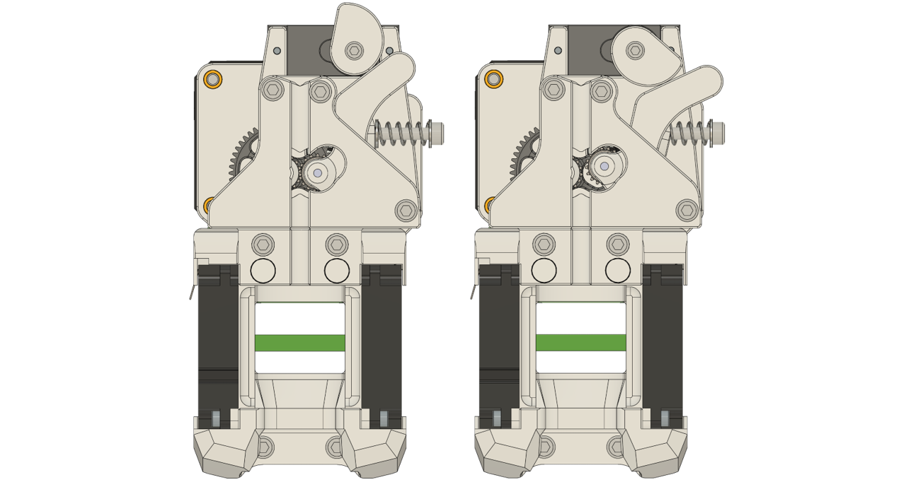
The toolhead structure is simple and intuitive. A cam attached to the servo motor rotates to open the extruder gears. The tool and toolhead are securely held together by two pairs of neodymium magnets.

### 1. Extruder
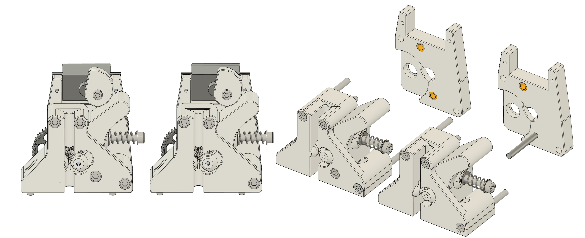
Two versions of the extruder are available:
1. **Use the Pin (Recommended):** Use the unthreaded 3x30mm pin included in the BMG gear kit.
2. **Use the M3x25mm Bolt:** Use an M3 SHCS 25mm instead of the pin.

I recommend using the unthreaded pin. However, if you are using that specific pin for a Nudge probe, you can substitute it with the M3 SHCS model.

*(Note: A version requiring a sleeve (OD 5mm, ID 3mm, Length 20mm) for the extruder lever is available but not strictly necessary to use.)*

**[BOM]**
- 1x BMG Extruder Kit (must be compatible with the Sherpa Mini or Sherpa Micro)
- 1x NEMA14 10T Stepper Motor
- 1x SG90s Servo Motor
- 2x M3 SHCS 35mm
- 1x M3 SHCS 30mm
- 3x M3 SHCS 25mm
- 2x M3 SHCS 8mm
- 2x M3 Washers
- 3x M3 Heat Set Inserts (OD 4.5mm, L 4mm)
- 1x M2.5 SHCS 6mm
- 2x M2 SHCS 8mm

### 2. Fan Duct
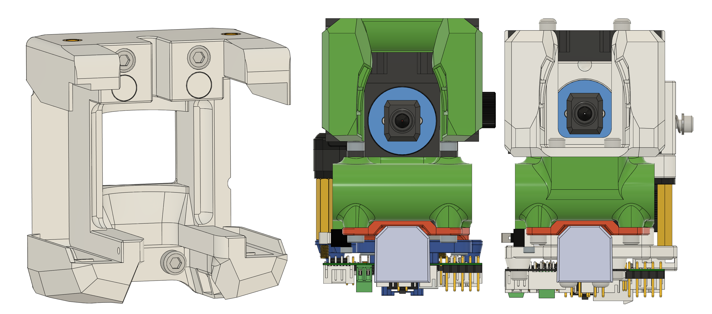
The fan duct model retains the original E3NG 4010 fan duct shape, aligned perfectly with the nozzle position.
Each blower fan must be secured with two bolts. Depending on the brand of blower fan you use, there might be a small gap at the mounting holes. We recommend printing a spacer(/STLs/Toolhead/E3NG_ToolChanger_Fanduct_fan_spacer_2mm.stl) to fill this gap. (The default model is optimized for GDSTime fans. For other brands, measure the gap manually and adjust the spacer thickness accordingly.)
Route the wiring for the left blower fan through the upper clearance space for neat cable management.
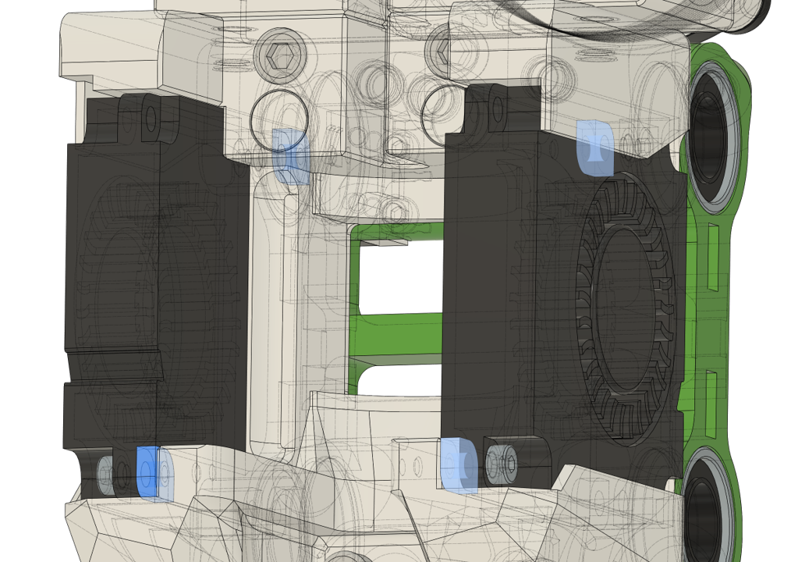

**[BOM]**
- 2x 4010 Blower Fans
- 2x Neodymium Magnets (OD 6mm, H 3mm)
- 2x M3 SHCS 25mm
- 2x M3 SHCS 6mm
- 2x M3 Heat Set Inserts (OD 4.5mm, L 4mm)
- 4x M2 SHCS 8mm

### 3. Toolboard
Mounts for both the **EBB36** and **EBB42** are available.
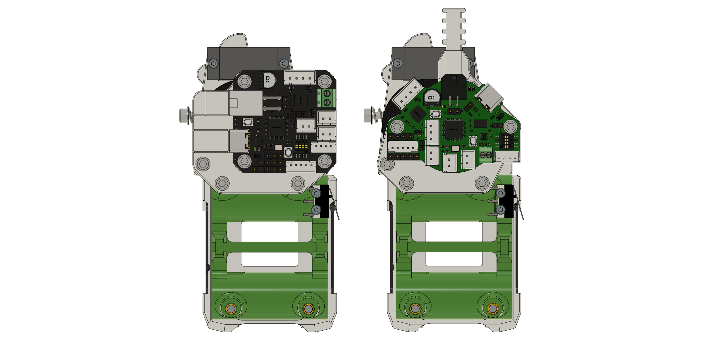
The EBB36 version routes cables upwards, which may cause annoying interference with the hotend wiring. Therefore, I highly recommend using the EBB42, which neatly routes cables to the side.
*(Note: The EBB42 mount requires an additional 2x M3 heat set inserts and 2x M3 SHCS 8mm.)*

*Caution: The design was not modeled with **Gen2** compatibility in mind, so proceed with caution.*

*You can reuse your existing probe without issues.*

**[BOM]**
- 1x EBB42 or EBB36
- 2x M3 Standoffs (20mm)
- 6x M3 SHCS 8mm (+2 extra if using EBB42)
- 2x M3 SHCS 12mm
- 4x M3 Heat Set Inserts (OD 4.5mm, L 4mm) (+2 extra if using EBB42)

### 4. X Gantry
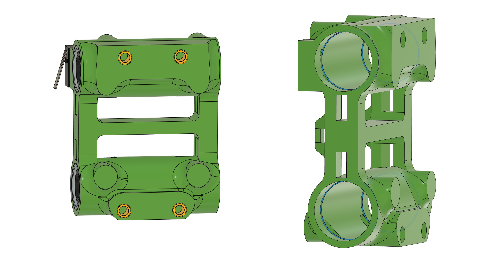
The X Gantry shape has been modified to accommodate the toolchanger fan duct and must be reprinted.
A reinforcement bar has been added to the center, along with protrusions inside the linear bushing holes to secure the bushings better. If the tolerance on these holes is too loose, the linear bushings will wobble. Ensure your slicer settings provide tight tolerances for this part.

**[BOM]**
- 2x LM8LUU Linear Bearings
- 1x D2F-L Limit Switch
- 8x M3 Heat Set Inserts (OD 4.5mm, L 4mm)
- 2x M2 SHCS 10mm

### 5. Y Gantry
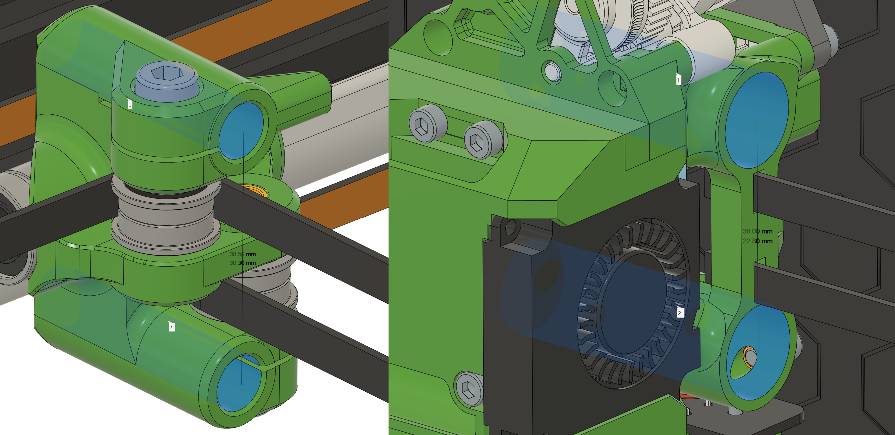
A discrepancy was discovered in previous models: the distance between smooth rods on the original Y-block was 38.5mm, while the distance between linear bushings on the X-gantry was 38mm.

I corrected and standardized the spacing to 38mm, and realigned the bearings and belts. If your current setup works fine, you don't have to rebuild it. But if you are building a new one or replacing the Y-blocks, use this updated version.

Additionally, a Beta-style Y-block has been included. If you are currently using the E3NG Beta Y-blocks for V1.2, you MUST upgrade to this new Beta style. The old beta blocks will collide with the fan duct, restricting your X-axis movement. 
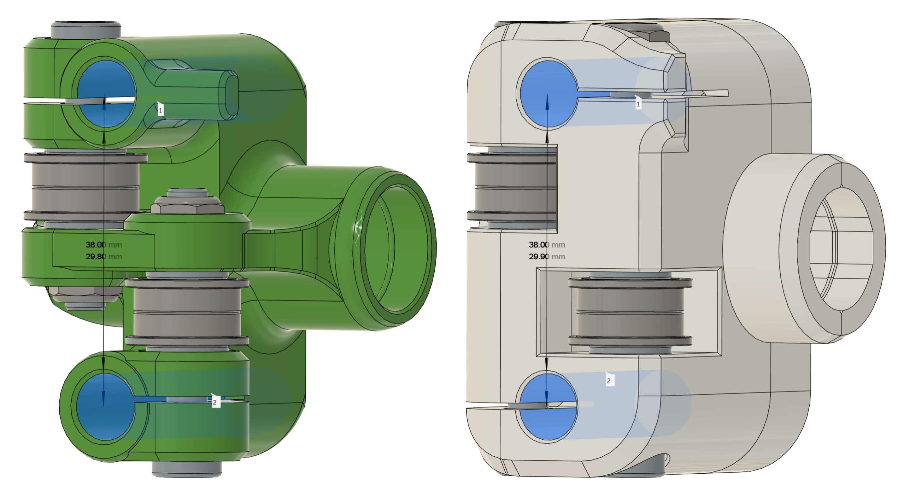
The fastening method for all Y-blocks has been changed from heat-set inserts to nylon lock nuts. Inserts sometimes caused twisting and part breakage during tightening; nylon nuts provide a secure, anti-vibration lock without over-tightening. Like the X Gantry, protrusions have been added to the linear bushing holes to clamp them securely.

Assembly Notes:
- V1.2 Style: Insert the linear bushings flush with the end of the printed part.
- Beta Style: Align the groove of the linear bushing with the protrusion on one half of the printed part, then bolt the two halves together. Verify that the bearings are firmly clamped after assembly.

**[BOM]**
- 2x LM8LUU Linear Bearings
- 4x M5 Nylon Nuts
- 8x M5 Washers
- 8x F695 Bearings

For V1.2 Style Y-blocks:
- 4x M5 SHCS 30mm

For Beta Style Y-blocks:
- 4x M5 SHCS 50mm
- 8x M3 SHCS 15mm
- 8x M3 Heat Set Inserts (OD 4.5mm, L 4mm)

### 6. Hotend (Tool)
[ATTENTION] The BOM below is per ONE tool. Multiply the quantities by the total number of tools you plan to build.

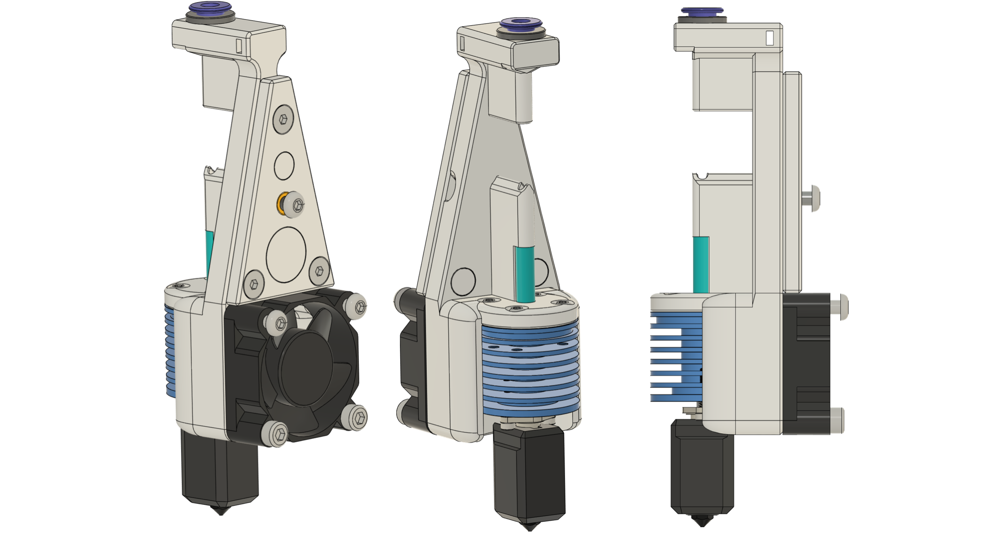
We use the TZ-V6 3.0 hotend. Before installing the hotend, cut the PTFE tube to an exact length of 18mm and insert it.
Remove the default V6 mount attached to the TZ-V6 3.0, and secure it using four M2.5 BHCS 6mm. *(Note: The M2.5 BHCS 8mm included in the hotend kit may touch the heatsink. It is usable, but we strongly recommend sourcing M2.5 BHCS 6mm instead.)*
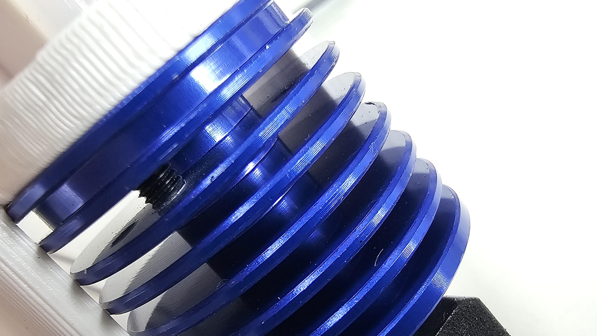

For the ECAS04 fitting, remove the bottom rubber component and use only the top plastic section. Double-check the magnetic polarity before inserting any magnets. 
At the front of the tool, three BHCS are used for docking/parking the tool. You can substitute these with SHCS, but DO NOT use FHCS. These three bolts should not be tightened all the way; the bolt heads must protrude by at least 2mm. We advise applying CA glue to lock them permanently.
Please note that this section requires four 3mm height heat set inserts (not the standard 4mm), so be cautious during insertion.
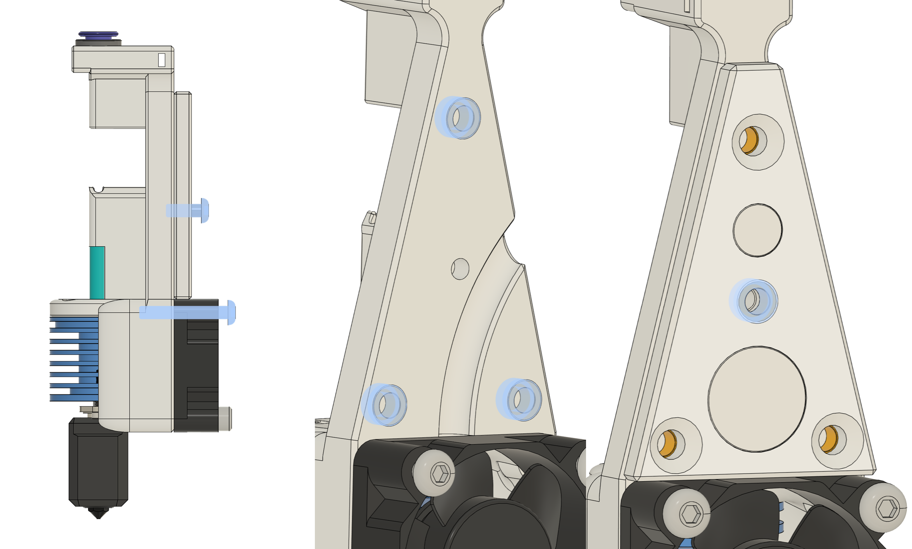

[BOM - Per Tool]
- 1x TZ-V6 3.0 Hotend
- 1x 3010 Fan
- 1x PTFE TUBE (ID 2mm/1.9mm, OD 4mm, Length: 18mm)
- 1x ECAS04 Fitting (top part only)
- 3x Neodymium Magnets (OD 6mm, H 3mm)
- 1x Neodymium Magnet (OD 12mm, H 3mm)
- 2x M3 SHCS 14mm
- 2x M3 BHCS 20mm
- 1x M3 BHCS 8mm
- 3x M3 FHCS 6mm
- 4x M3 Heat Set Inserts (OD 4.5mm, L 4mm)
- 4x M3 Heat Set Inserts (OD 5.0mm, L 3mm)
- 4x M2.5 BHCS 6mm (Recommended)

### 7. Tool Dock

The default models are designed for a 330mm extrusion profile, but the system supports profiles up to 350mm. To adjust for a different profile length:

1. Open Autodesk Fusion and load E3NG_Toolchanger_Profile_Bracket.f3d from the CAD folder.
2. Modify the dimension parameter to match your extrusion length. The model geometry will automatically update.
3. Export the updated body as a mesh and slice/print.
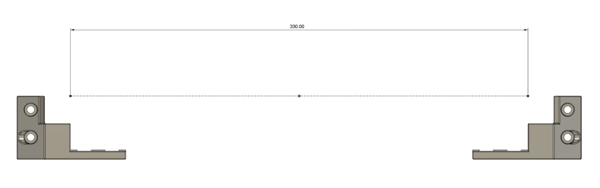

[CRITICAL] When assembled with the profile, the total distance from end to end of the dock MUST be exactly 407mm. Even a 0.5mm deviation will cause severe gantry twisting, so ensure this measurement is precise. 
The brackets are designed for Ender-3 style V-slot extrusions. If you are using European standard extrusions (e.g., Misumi), you will need to modify the models.

[BOM - Profile Bracket]
- 4x M5 SHCS 8mm
- 2x M5 SHCS 15mm
- 4x M5 T-Nuts

[BOM - Per Tool Docking Slot]
- 1x Neodymium Magnet (OD 12mm, H 3mm)
- 1x Neodymium Magnet (OD 6mm, H 3mm)
- 2x M4 SHCS 20mm
- 2x M4 FHCS 10mm
- 4x M4 T-Nuts

### 8. Electronics - Top
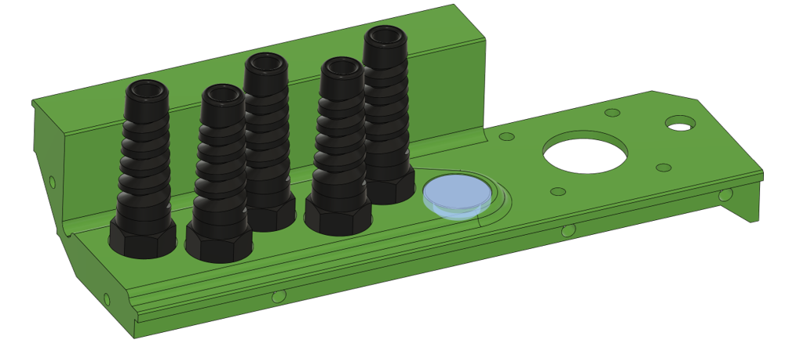
Additional holes have been added to smoothly route the hotend wiring. Use a PG7 flexible cable gland, or use the provided printable alternative instead. Plug any unused holes by printing the hole_cover model.

**[BOM]**
- PG7 Flexible Cable Gland (or printed alternative)

### 9. Enclosure
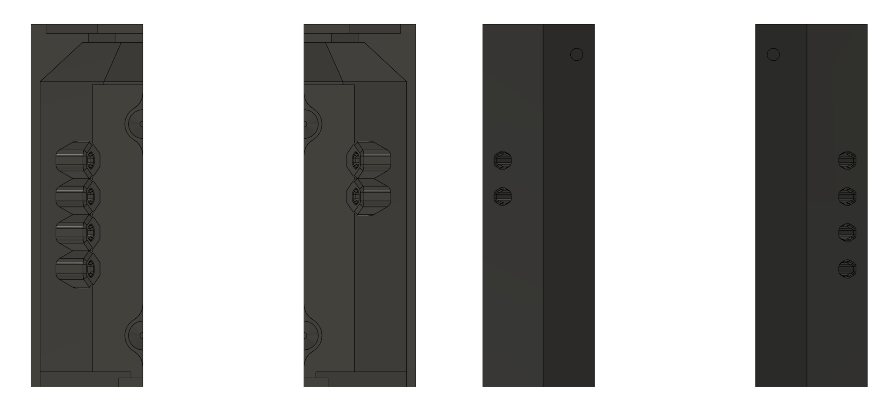
I have added lid corner models with 4 and 2 holes to route multiple PTFE tubes out of the enclosure. The current design assumes an external setup with 4 spools on the left and 2 on the right. 
Options for a 3/3 split or an internal spool holder are currently under consideration for future updates.

---

## Experimental Features
Models located in the /Experimental folder are highly experimental and may not work perfectly depending on your setup. Use them at your own risk.

### Nozzle Wiper
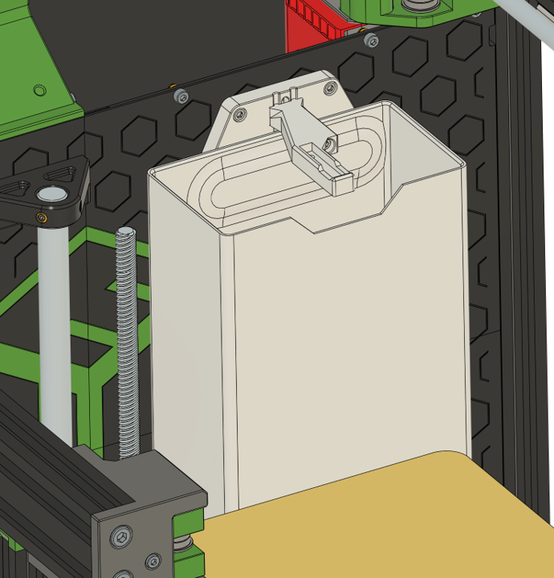
To maintain print quality during tool changes, we highly recommend a slight purge and wipe sequence for every nozzle swap. Because toolchangers require minimal purging, the bucket size may be reduced in future iterations. Use a Bambu Lab A1 mini silicone brush for the wiper.

Note: If you are using the stock or printed bed carriage, the bucket will collide with the Nudge (or Sexbolt). In this case, print and use the provided alternative bed arm, which flips the position of the insert used to mount the sexbolt.
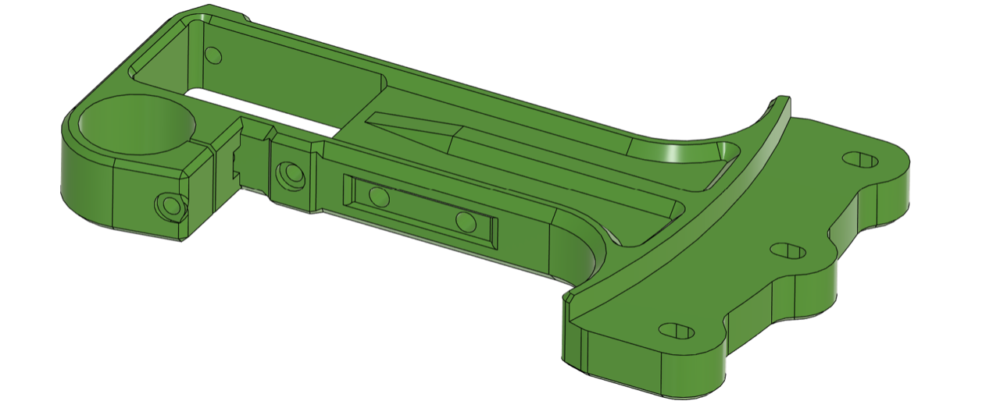

**[BOM]**
- 4x Neodymium Magnets (OD 12mm, H 3mm)
- 1x Silicone Nozzle Brush for Bambu Lab A1 Mini
- 1x M3 SHCS 35mm
- 3x M3 SHCS 10mm
- 1x M3 Nut

### Nudge Base for Metal Bed
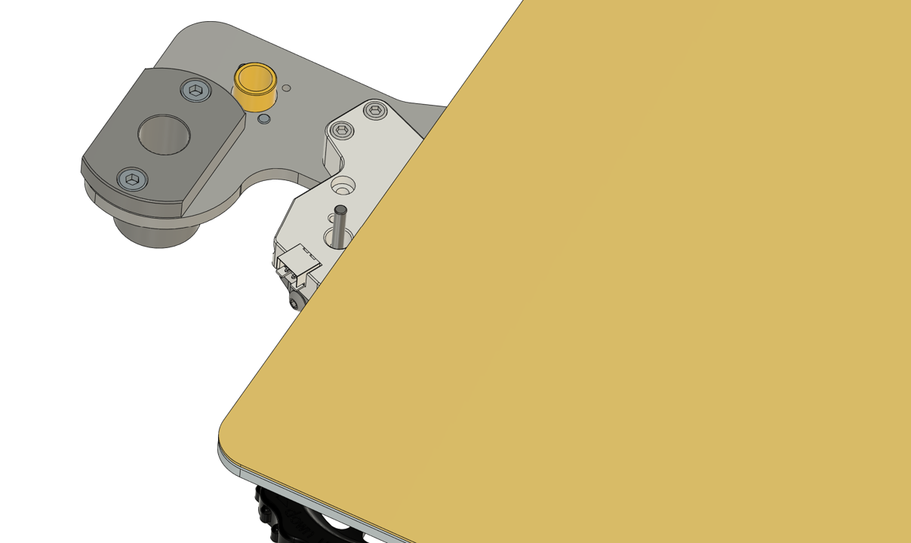
A dedicated Nudge base intended for use with metal bed carriages. Keep the original Nudge Wobbler part and only reprint and replace the base component.

**[BOM]**
- 4x M3 SHCS 12mm
- (Remaining original Nudge components)

### Tool Park

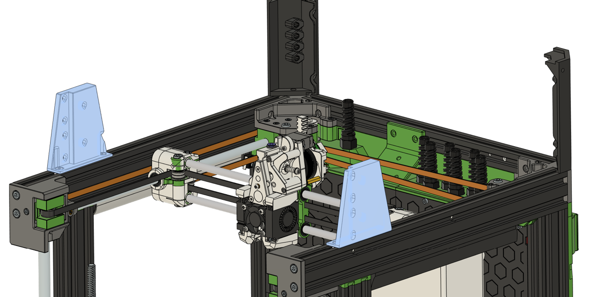
Implementing a toolchanger natively results in a loss of about 50mm in the Y-axis build volume. When printing in a single color (single tool), you can "park" unused tools on this structure to reclaim that lost volume. Essentially, this allows you to utilize the full 230x230mm build volume exclusively for single-filament prints.
However, this structure only holds up to 4 tools, making it unsuitable if you are running a full 6-tool system.

**[BOM]**
- 4x M4 FHCS 8mm
- 4x M4 T-Nuts